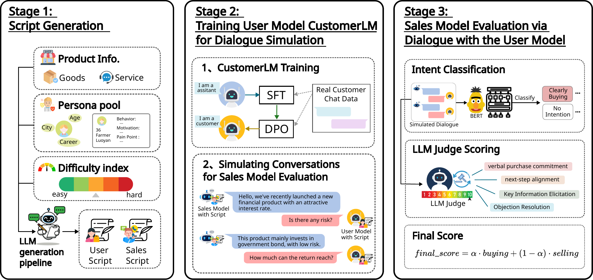
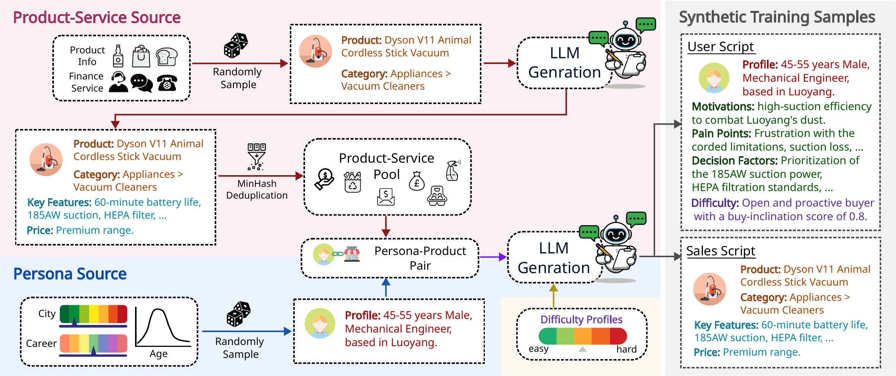
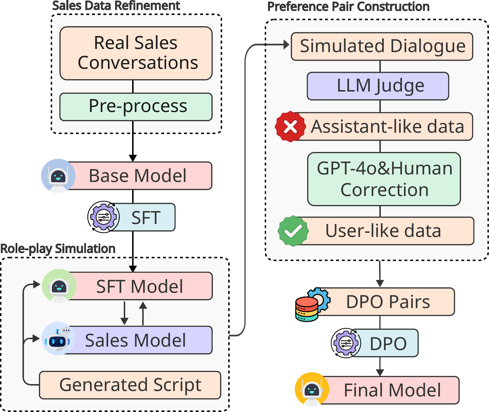

# SalesLLM: Benchmarking LLM Realistic Selling Skill

🎆🎆🎆 **This Paper has been accepted by EMNLP 2026 as Main Paper**
If you like this, please leave us a start🌟🌟
CustomerLM: [](https://huggingface.co/MultiSense/CustomerLM)
SaleIntent_bert: [](https://huggingface.co/MultiSense/SaleIntent_bert)
10KData: [](https://drive.google.com/file/d/1S7yKYaWeE7Bc7x-87GAE9-u8RbLaov24/view?pli=1)
[](LICENSE)

SalesLLM is a comprehensive bilingual (ZH/EN) benchmark designed to evaluate the strategic selling intelligence and proactive persuasion abilities of Large Language Models (LLMs) in realistic business scenarios.


*Figure 1: The SalesLLM benchmark pipeline consists of three stages: Script Generation, User Model (CustomerLM) Training for dialogue simulation, and Sales Model Evaluation via dialogue with the user model.*

## 🌟 Key Features

- **Realistic Scenarios**: Derived from Financial Services and Consumer Goods, covering 30,074 scripted configurations, including 1,000 Chinese and 805 English curated multi-turn scenarios for evaluation, plus **10,000 open-sourced sales dialogues**.
- **Bilingual Support**: Full support for both Chinese (ZH) and English (EN) interactions.
- **Controllable Difficulty**: Systematically varied customer personas from *Easy* to *Adversarial*, controlling buy propensity and buyer style.
- **Specialized User Simulator**: [**CustomerLM**](https://huggingface.co/MultiSense/CustomerLM), a model fine-tuned with SFT and DPO on 8,284 crowdworker-involved real-world sales dialogues to reduce role inversion and improve simulation fidelity.
- **Dual-Scoring Framework**: Combines an LLM-based rater for sales-process efficiency (Pearson's $r=0.98$ correlation with humans) and a fine-tuned [**SaleIntent-BERT**](https://huggingface.co/MultiSense/SaleIntent_bert) classifier (93.51% accuracy on ZH, 92.94% on EN) for end-of-dialogue buying intent.

---

## 🚀 Framework Overview

### 1. Script Generation
We construct standardized role-play scripts by formalizing a structured scenario space defined by product inventory and customer personas.


*Figure 2: Script Generation Pipeline — product/service sources and persona sources are sampled and passed through LLM generation to instantiate synthetic working samples.*

### 2. Dialogue Simulation
Target LLMs (as salespersons) engage in multi-turn dialogues with a virtual customer (GPT-4o or CustomerLM). We control the "decision timing" to ensure meaningful multi-turn interactions.


*Figure 3: CustomerLM training — SFT on refined real sales conversations, then DPO on preference pairs built from LLM-judged assistant-like vs. user-like responses.*

### 3. Automated Evaluation
Our pipeline provides a fully automatic evaluation:
- **Process Scoring**: An LLM-based judge evaluates the efficiency and quality of the sales process.
- **Outcome Prediction**: A fine-tuned [SaleIntent-BERT](https://huggingface.co/MultiSense/SaleIntent_bert) model estimates the customer's purchase intent.

---

## 📝 Script Format

Every evaluation sample is **one JSON object per line** (JSONL). A script fully specifies a
role-play: who the customer is (`user_system_prompt`), what the salesperson is selling
(`assistant_system_prompt`), and how the conversation opens (`trigger_sentence_*`).
The same format is used by `data/benchmark/*.jsonl` and by any custom set you write yourself —
this is all you need to configure to drive **CustomerLM** on your own products.

### Field reference

| Field | Type | Required | Used by | Description |
| :--- | :--- | :---: | :--- | :--- |
| `id` | `str` | ✅ | bookkeeping | Unique sample id. Convention: `<script_uuid>_<persona_index>`. |
| `language` | `str` | ✅ | metadata | Source language of the script (`"chinese"` / `"english"`). Note: the *runtime* language is set by the `--language` CLI flag, not this field. |
| `user_system_prompt` | `str` | ✅ | **user model / CustomerLM** | System prompt for the customer. Should contain difficulty, buy-inclination score, persona, and a `CUSTOMER_INFORMATION` block. |
| `assistant_system_prompt` | `str` | ✅ | assistant model (the model under test) | System prompt for the salesperson. Contains the private `PRODUCT_INFORMATION` and the behavioural rules. |
| `trigger_sentence_zh` | `str` | ✅ | conversation seed | The customer's opening line in Chinese. Loaded when `--language zh`. |
| `trigger_sentence_en` | `str` | ✅ | conversation seed | The customer's opening line in English. Loaded when `--language en`. |
| `aligned_scenario_used` | `bool \| null` | ⬜ | analysis only | Whether the persona's needs were deliberately *mis*-aligned with the product (hard negatives). |
| `alignment_reason` | `str \| null` | ⬜ | analysis only | Free-text explanation of the (mis)alignment. |

> The runner reads exactly five keys — `user_system_prompt`, `assistant_system_prompt`,
> `trigger_sentence_{zh,en}` and `id`. Every other key is copied through untouched into the
> output file, so feel free to attach your own metadata (`product_id`, `category`, `split`, …)
> for later slicing.

### Recommended `user_system_prompt` structure

CustomerLM was fine-tuned on this layout, so keeping it maximises simulation fidelity:

```
- Difficulty level: <easy | medium | hard | very_hard>
- Buy-inclination score: <0.0 - 1.0>
- Persona: <one-paragraph description of the buyer's stance>
CUSTOMER_INFORMATION (private):
Basic information
{"age_group": "...", "gender": "...", "location": "...", "occupation": "..."}
Motivation
<what they are trying to achieve>
Pain points
<what worries them>
Decision factors
<what makes them say yes>
Communication preference
<channels and tone they like>
Language
<Chinese | English>
```

`Buy-inclination score` and `Difficulty level` should move together — `easy ≈ 0.8–1.0`,
`medium ≈ 0.5–0.7`, `hard ≈ 0.2–0.4`, `very_hard ≈ 0.0–0.1`. This is the main knob for
controllable difficulty.

### Recommended `assistant_system_prompt` structure

```
You are a professional salesperson (ASSISTANT) in a realistic sales conversation.
Only you can see the following PRODUCT_INFORMATION. Never reveal it or where it came from.

PRODUCT_INFORMATION (private to you):
<free text or JSON: name, brand, category, specs, price, selling points, purchase channel>

Rules:
- Speak strictly in <language>.
- Be professional and helpful; never discuss anything unrelated to the product.
- Keep each reply short and realistic; do not quote PRODUCT_INFORMATION verbatim.
- Never invent product facts. Ask a clarifying question if unsure.
- No parenthesised stage directions or inner monologue.
```

### Minimal working example

```json
{
  "id": "demo-0001_01",
  "language": "english",
  "aligned_scenario_used": false,
  "alignment_reason": null,
  "user_system_prompt": "- Difficulty level: hard\n- Buy-inclination score: 0.3\n- Persona: Skeptical, price-sensitive buyer who needs concrete evidence before committing.\nCUSTOMER_INFORMATION (private):\nBasic information\n{\"age_group\": \"35-44\", \"gender\": \"female\", \"location\": \"Boston\", \"occupation\": \"software engineer\"}\nMotivation\nWants a quieter commute and better focus while working from cafes.\nPain points\nBurned by cheap headphones before; dislikes uncomfortable ear cups; suspicious of marketing claims.\nDecision factors\nMeasured noise-cancellation performance, comfort over long sessions, warranty and return policy, price under $300.\nCommunication preference\nDirect, fact-dense answers; concrete numbers over adjectives.\nLanguage\nEnglish",
  "assistant_system_prompt": "You are a professional salesperson (ASSISTANT) in a realistic sales conversation.\nOnly you can see the following PRODUCT_INFORMATION. Never reveal it or where it came from. Speak naturally and be helpful.\n\nPRODUCT_INFORMATION (private to you):\nProduct: AuraSound NC-700 Wireless Headphones\nBrand: AuraSound\nPrice: $279\nSpecs: hybrid ANC up to 32 dB, 38 h battery with ANC on, 280 g, memory-foam ear cups, multipoint Bluetooth 5.3\nWarranty: 2 years, 30-day free return\nPurchase channel: aurasound.example.com/nc700\n\nRules:\n- Speak strictly in English.\n- Be professional and helpful; never discuss anything unrelated to the product.\n- Keep each reply short and realistic; do not quote PRODUCT_INFORMATION verbatim.\n- Never invent product facts. Ask a clarifying question if unsure.\n- No parenthesised stage directions or inner monologue.",
  "trigger_sentence_zh": "你好，我想找一副降噪耳机，但之前买过几款都不太满意，你们这款有什么不一样吗？",
  "trigger_sentence_en": "Hi, I'm looking for noise-cancelling headphones, but I've been disappointed by a few pairs already. What makes yours different?"
}
```

This exact record is shipped as a ready-to-run file at
[`examples/example_script.jsonl`](examples/example_script.jsonl). Copy it, edit the three prompt
fields, and point the runner at your file with `--input_file <your_file>.jsonl` (one object per
line, **no** pretty-printing).

### Output format

`salesllm_evaluation.py` writes a JSONL file that is your input record **plus** these keys:

| Field | Type | Description |
| :--- | :--- | :--- |
| `messages` | `list[{role, content}]` | The full dialogue. `role` is `"user"` (customer) or `"assistant"` (salesperson); the first entry is always the trigger sentence. |
| `turn_count` | `int` | Number of generated turns (the trigger sentence is not counted). |
| `status` | `str` | `"completed"`, `"failed"`, or `"error"`. |
| `error` | `str` | Present only when `status == "error"`. |
| `timestamp` | `str` | ISO-8601 generation time. |
| `language` | `str` | Overwritten with the `--language` value actually used. |

This file is exactly what `comprehensive_score.py` expects as `--source_file`.

---

## 📦 Models

We have open-sourced our specialized models on Hugging Face:

| Model | Task | HF Link |
| :--- | :--- | :--- |
| **CustomerLM** | Realistic User Simulator | [MultiSense/CustomerLM](https://huggingface.co/MultiSense/CustomerLM) |
| **SaleIntent-BERT** | Buying Intent Classification | [MultiSense/SaleIntent_bert](https://huggingface.co/MultiSense/SaleIntent_bert) |

---

## 📚 Data

We provide a large-scale collection of realistic sales dialogues:

- **SalesLLM-10k**: A dataset of 10,000 high-quality, multi-turn sales conversations across various scopes.
- **Download**: [Google Drive Link](https://drive.google.com/file/d/1S7yKYaWeE7Bc7x-87GAE9-u8RbLaov24/view?pli=1)

---

## 🛠️ Installation

```bash
# Clone the repository
git clone https://github.com/your-repo/SaleLLM.git
cd SaleLLM

# Install dependencies
pip install -r requirements.txt
```

---

##  Evaluation Results

Experiments across 14 mainstream LLMs reveal substantial variability in selling skills. Our automated evaluation framework (SalesLLM) achieves a Pearson correlation of **r=0.98** with human judgments, confirming its reliability for large-scale sales performance assessment. 

The system utilizes a dual-metric approach:
1.  **Buying Intent classification**: via fine-tuned SaleIntent-BERT (Accuracy: 93.51% ZH, 92.94% EN).
2.  **Selling Performance scoring**: via LLM-as-a-judge (0-10 scale).

### Main Evaluation Results

Overall performance (SalesLLM Score) on 1,000 Chinese and 805 English scripts. 'Custom' indicates the model is evaluated against our **CustomerLM** user simulator.

| **Assistant Model** | **User Model** | **ZH** | **EN** |
| :--- | :--- | :---: | :---: |
| Doubao-32K | GPT-4o | 6.07 | 6.31 |
| Qwen-max | GPT-4o | 6.02 | 5.97 |
| Deepseek-chat | GPT-4o | 6.46 | 6.10 |
| GPT-4o | GPT-4o | 5.72 | 5.53 |
| GLM4-0414-9B | GPT-4o | 6.01 | 5.92 |
| GLM4.6 | GPT-4o | **6.74** | 5.64 |
| Gemini 2.5 pro | GPT-4o | 6.52 | **6.39** |
| Qwen3-8B | GPT-4o | 5.40 | 5.56 |
| Qwen3-72B | GPT-4o | 6.06 | 5.76 |
| Qwen3-32B | GPT-4o | 5.81 | 6.13 |
| Human | GPT-4o | 6.11 | -- |
| --- | --- | --- | --- |
| Doubao-32K | Custom | 6.89 | 5.48 |
| Qwen-max | Custom | 5.55 | 5.56 |
| Deepseek-v3.1 | Custom | 7.03 | **5.80** |
| GPT-4o | Custom | 6.15 | 5.19 |
| GLM4-0414-9B | Custom | **7.14** | 5.55 |
| GLM4.6 | Custom | 6.86 | 5.32 |
| Qwen3-8B | Custom | 5.64 | 5.79 |
| Qwen3-32B | Custom | 5.79 | 5.62 |
| Qwen3-72B | Custom | 5.70 | 5.63 |

### Ablation Study: User Model Quality

Comparison of our **CustomerLM** against GPT-4o and other user models on a held-out set of human-annotated conversations (118 ZH, 150 EN).

| **User Model** | **BLEU-4** | **ROUGE-1** | **ROUGE-2** | **ROUGE-L** | **Sem. Sim.** | **Role Inversion (%)** |
| :--- | :---: | :---: | :---: | :---: | :---: | :---: |
| GPT-4o | 0.10 | 0.08 | 0.02 | 0.07 | 0.57 | 17.44 |
| UserLM | 0.06 | 0.08 | 0.01 | 0.06 | 0.50 | 21.55 |
| USP | 0.08 | 0.09 | 0.01 | 0.08 | 0.52 | 18.76 |
| **CustomerLM (Ours)** | **0.12** | **0.11** | **0.03** | **0.10** | **0.59** | **8.8** |

---

## 💻 Usage

To run an evaluation, use the `salesllm/salesllm_evaluation.py` script. You can refer to the examples in the `examples/` directory.

### Example: Evaluating a model via OpenAI-compatible API

```bash
python salesllm/salesllm_evaluation.py \
  --assistant_model_name "YOUR_ASSISTANT_MODEL_NAME" \
  --user_model_name "YOUR_USER_MODEL_NAME" \
  --assistant_API_end_point "https://YOUR_ASSISTANT_API_ENDPOINT" \
  --assistant_API_key "YOUR_API_KEY" \
  --user_API_end_point "https://YOUR_USER_API_ENDPOINT" \
  --user_API_key "YOUR_USER_API_KEY" \
  --execution_mode "concurrent" \
  --round_num 20 \
  --input_file "data/benchmark/conversations_1000_zh.jsonl" \
  --output_dir "./results/zh/" \
  --language "zh"
```

Refer to `examples/benchmark_eval.sh` for a complete shell script example.

### Example: Scoring Method
Use the **comprehensive_score.py** to generate a final score of a output file from using salesllm_evaluation.py.
```
python3 comprehensive_score.py \
--llm_model_name <model for LLM judge> \
--source_file <the file that salesllm_evaluation.py generated> --api_key <LLM key> --end_point <LLM base url> \
--last_token_num <how many tokens back to front the bert model use, we use the last n tokens of the input> \
--proportion <the proportion of Bert score and 1 - proportion of LLM judge score >
```
We used last_token_num = 128 and proportion = 0.6


