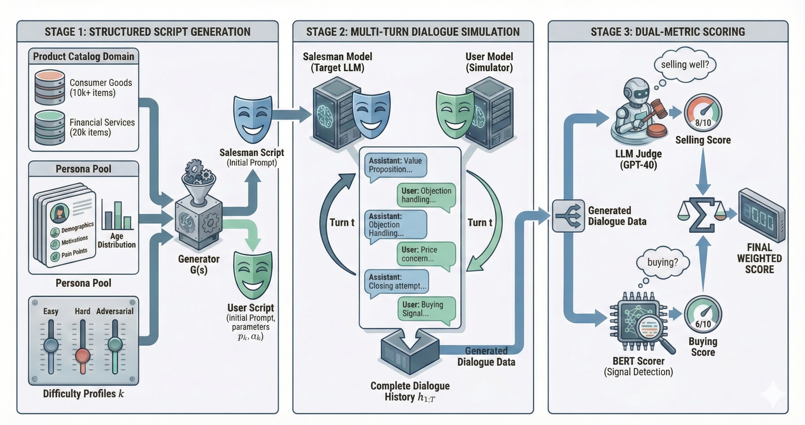
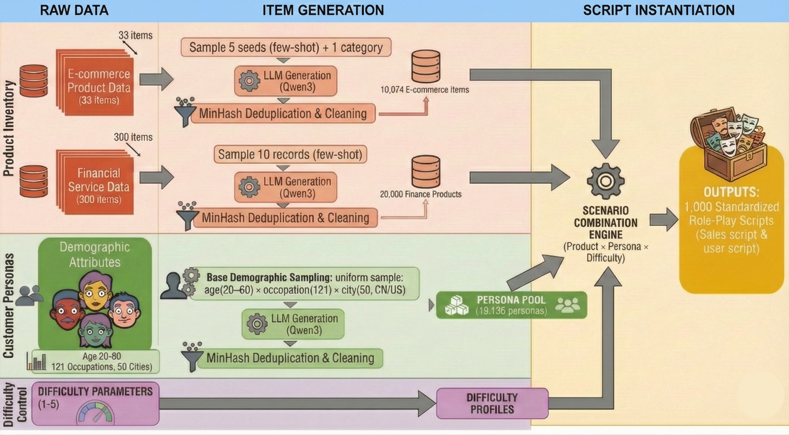
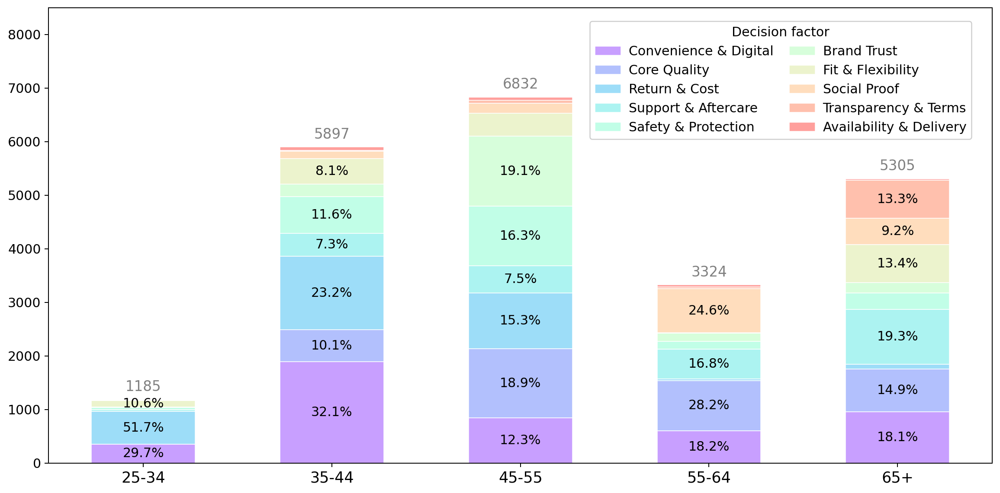

# SalesLLM: Benchmarking LLM Realistic Selling Skill

[](https://huggingface.co/MultiSense/CustomerLM)
[](https://huggingface.co/MultiSense/SaleIntent_bert)
[](https://drive.google.com/file/d/1S7yKYaWeE7Bc7x-87GAE9-u8RbLaov24/view?pli=1)
[](LICENSE)

SalesLLM is a comprehensive bilingual (ZH/EN) benchmark designed to evaluate the strategic selling intelligence and proactive persuasion abilities of Large Language Models (LLMs) in realistic business scenarios.


*Figure 1: The SalesLLM benchmark pipeline consists of three stages: Script Generation, Dialogue Simulation, and Automated Scoring.*

## 🌟 Key Features

- **Realistic Scenarios**: Derived from Financial Services and Consumer Goods, covering 30,074 scripted configurations, including 1,000 Chinese and 805 English curated multi-turn scenarios for evaluation, plus **10,000 open-sourced sales dialogues**.
- **Bilingual Support**: Full support for both Chinese (ZH) and English (EN) interactions.
- **Controllable Difficulty**: Systematically varied customer personas from *Easy* to *Adversarial*, controlling buy propensity and buyer style.
- **Specialized User Simulator**: [**CustomerLM**](https://huggingface.co/MultiSense/CustomerLM), a model fine-tuned with SFT and DPO on 8,284 crowdworker-involved real-world sales dialogues to reduce role inversion and improve simulation fidelity.
- **Dual-Scoring Framework**: Combines an LLM-based rater for sales-process efficiency (Pearson's $r=0.98$ correlation with humans) and a fine-tuned [**SaleIntent-BERT**](https://huggingface.co/MultiSense/SaleIntent_bert) classifier (93.51% accuracy on ZH, 92.94% on EN) for end-of-dialogue buying intent.

---

## 🚀 Framework Overview

### 1. Script Generation
We construct standardized role-play scripts by formalizing a structured scenario space defined by product inventory and customer personas.


*Figure 2: Script Generation Pipeline from product inventory synthesis to script instantiation.*

### 2. Dialogue Simulation
Target LLMs (as salespersons) engage in multi-turn dialogues with a virtual customer (GPT-4o or CustomerLM). We control the "decision timing" to ensure meaningful multi-turn interactions.


*Figure 3: Decision Factor Distribution by Age Group in the SalesLLM persona set.*

### 3. Automated Evaluation
Our pipeline provides a fully automatic evaluation:
- **Process Scoring**: An LLM-based judge evaluates the efficiency and quality of the sales process.
- **Outcome Prediction**: A fine-tuned [SaleIntent-BERT](https://huggingface.co/MultiSense/SaleIntent_bert) model estimates the customer's purchase intent.

---

## 📦 Models

We have open-sourced our specialized models on Hugging Face:

| Model | Task | HF Link |
| :--- | :--- | :--- |
| **CustomerLM** | Realistic User Simulator | [MultiSense/CustomerLM](https://huggingface.co/MultiSense/CustomerLM) |
| **SaleIntent-BERT** | Buying Intent Classification | [MultiSense/SaleIntent_bert](https://huggingface.co/MultiSense/SaleIntent_bert) |

---

## 📚 Data

We provide a large-scale collection of realistic sales dialogues:

- **SalesLLM-10k**: A dataset of 10,000 high-quality, multi-turn sales conversations across various scopes.
- **Download**: [Google Drive Link](https://drive.google.com/file/d/1S7yKYaWeE7Bc7x-87GAE9-u8RbLaov24/view?pli=1)

---

## 🛠️ Installation

```bash
# Clone the repository
git clone https://github.com/your-repo/SaleLLM.git
cd SaleLLM

# Install dependencies
pip install openai tqdm
```

---

##  Evaluation Results

Experiments across 14 mainstream LLMs reveal substantial variability in selling skills. Our automated evaluation framework (SalesLLM) achieves a Pearson correlation of **r=0.98** with human judgments, confirming its reliability for large-scale sales performance assessment. 

The system utilizes a dual-metric approach:
1.  **Buying Intent classification**: via fine-tuned SaleIntent-BERT (Accuracy: 93.51% ZH, 92.94% EN).
2.  **Selling Performance scoring**: via LLM-as-a-judge (0-10 scale).

### Main Evaluation Results

Overall performance (SalesLLM Score) on 1,000 Chinese and 805 English scripts. 'Custom' indicates the model is evaluated against our **CustomerLM** user simulator.

| **Assistant Model** | **User Model** | **Ours (ZH)** | **Ours (EN)** |
| :--- | :--- | :---: | :---: |
| Doubao-32K | GPT-4o | 6.07 | 6.31 |
| Qwen-max | GPT-4o | 6.02 | 5.97 |
| Deepseek-chat | GPT-4o | 6.46 | 6.10 |
| GPT-4o | GPT-4o | 5.72 | 5.53 |
| GLM4-0414-9B | GPT-4o | 6.01 | 5.92 |
| GLM4.6 | GPT-4o | **6.74** | 5.64 |
| Gemini 2.5 pro | GPT-4o | 6.52 | **6.39** |
| Qwen3-8B | GPT-4o | 5.40 | 5.56 |
| Qwen3-72B | GPT-4o | 6.06 | 5.76 |
| Qwen3-32B | GPT-4o | 5.81 | 6.13 |
| Human | GPT-4o | 6.11 | -- |
| --- | --- | --- | --- |
| Doubao-32K | Custom | 6.89 | 5.48 |
| Qwen-max | Custom | 5.55 | 5.56 |
| Deepseek-v3.1 | Custom | 7.03 | **5.80** |
| GPT-4o | Custom | 6.15 | 5.19 |
| GLM4-0414-9B | Custom | **7.14** | 5.55 |
| GLM4.6 | Custom | 6.86 | 5.32 |
| Qwen3-8B | Custom | 5.64 | 5.79 |
| Qwen3-32B | Custom | 5.79 | 5.62 |
| Qwen3-72B | Custom | 5.70 | 5.63 |

### Ablation Study: User Model Quality

Comparison of our **CustomerLM** against GPT-4o and other user models on a held-out set of human-annotated conversations (118 ZH, 150 EN).

| **User Model** | **BLEU-4** | **ROUGE-1** | **ROUGE-2** | **ROUGE-L** | **Sem. Sim.** | **Role Inversion (%)** |
| :--- | :---: | :---: | :---: | :---: | :---: | :---: |
| GPT-4o | 0.10 | 0.08 | 0.02 | 0.07 | 0.57 | 17.44 |
| UserLM | 0.06 | 0.08 | 0.01 | 0.06 | 0.50 | 21.55 |
| USP | 0.08 | 0.09 | 0.01 | 0.08 | 0.52 | 18.76 |
| **CustomerLM (Ours)** | **0.12** | **0.11** | **0.03** | **0.10** | **0.59** | **8.8** |

---

## 💻 Usage

To run an evaluation, use the `salesllm/salesllm_evaluation.py` script. You can refer to the examples in the `examples/` directory.

### Example: Evaluating a model via OpenAI-compatible API

```bash
python salesllm/salesllm_evaluation.py \
  --assistant_model_name "YOUR_ASSISTANT_MODEL_NAME" \
  --user_model_name "YOUR_USER_MODEL_NAME" \
  --assistant_API_end_point "https://YOUR_ASSISTANT_API_ENDPOINT" \
  --assistant_API_key "YOUR_API_KEY" \
  --user_API_end_point "https://YOUR_USER_API_ENDPOINT" \
  --user_API_key "YOUR_USER_API_KEY" \
  --execution_mode "concurrent" \
  --round_num 20 \
  --input_file "data/eval_data/conversations_1000_zh.jsonl" \
  --output_dir "./results/zh/" \
  --language "zh"
```

Refer to `examples/eval_model.sh` for a complete shell script example.

### Example: Scoring Method
Use the **comprehensive_score.py** to generate a final score of a output file from using salesllm_evaluation.py.
```
python3 comprehensive_score.py \
--llm_model_name <model for LLM judge> \
--source_file <the file that salesllm_evaluation.py generated> --api_key <LLM key> --end_point <LLM base url> \
--last_token_num <how many tokens back to front the bert model use, we use the last n tokens of the input> \
--proportion <the proportion of Bert score and 1 - proportion of LLM judge score >
```
We used last_token_num = 128 and proportion = 0.6


